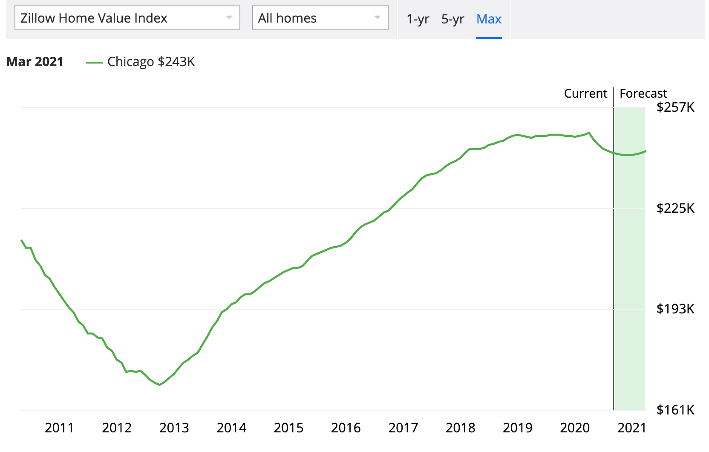
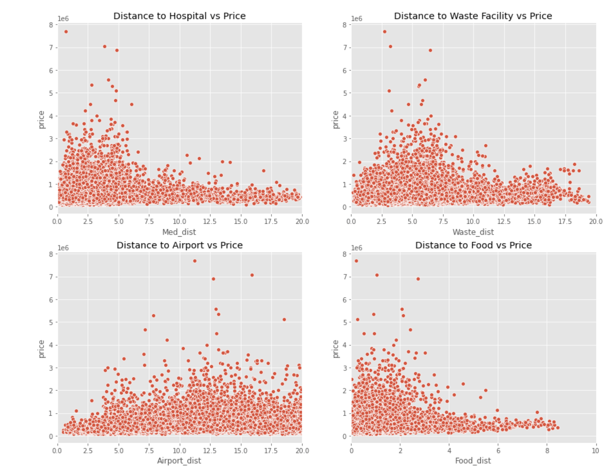
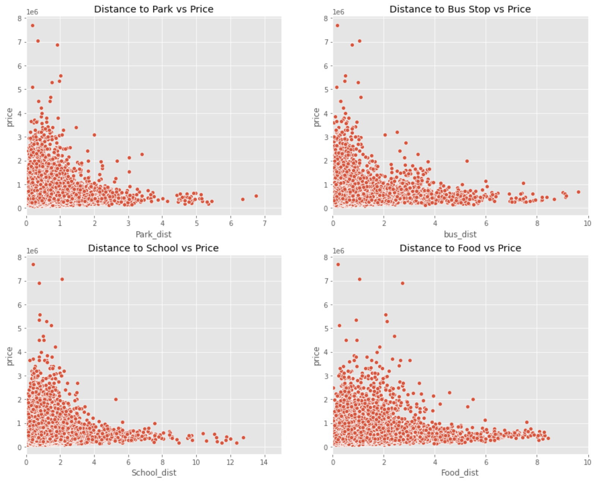
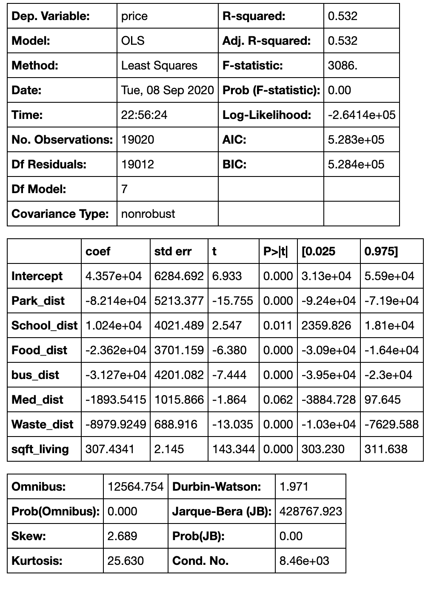

# How to Purchase a Home in King County, WA or Where Did My Money Go?
by Connor Pate and Lavender Zhang

Undeterred by a global pandemic and national unrest, the median price for a home in 2020 increased to $287,000, "up more than 7 percent from a year earlier" (["Home Prices are Rising, Along with Post-Lockdown Demand," NYT, June 2020](https://www.nytimes.com/2020/06/05/your-money/houses-prices-coronavirus.html)). That increase was recorded in June. As of August, every region, excluding the Northeast, has seen "double-digit, month-over-month increases" (["Existing-Home Sales Continue Record Pace, Soar 24.7% in July," NAR, August 2020](https://www.nar.realtor/newsroom/existing-home-sales-continue-record-pace-soar-24-7-in-july)). This trend, however, is not evenly distributed among metropolitan areas.

While large cities like New York City and Chicago have seen median home prices drop (-1.0, NYC, ~652K ([New York Prices, Zillow](https://www.zillow.com/new-york-ny/home-values/))) or stay nearly even (+0.6%, Chicago, ~249K ([Chicago Home Prices](https://www.zillow.com/chicago-il/home-values/))), the median home price in King County, WA increased 4.5% from the previous year, raising the median home price to $667,264 ([King County Home Prices, Zillow](https://www.zillow.com/king-county-wa/home-values/)).

New York City and Chicago have seen multiple consecutive years of population loss (["Chicago Area Drops", Chicago Tribune](https://www.chicagotribune.com/news/ct-met-census-chicago-cook-county-population-decline-20190408-story.html))), (["Is New York City's 'Remarkable Growth Story' Ending?"](https://www.nytimes.com/2019/04/18/nyregion/new-york-city-population.html)). According to census data, 2019 was the fourth straight year of population loss in Chicago with Cook County also seeing a decline. New York City lost 40,000 residents to other cities in 2019.

There is much to be said about census information, city/country trends, and relevant and prescient socio-economic information affecting population migration. That, however, is not in our analysis. While NY and Chicago have seen, _at the very least_, a slowdown in growth, Seattle has ranked within the top 2 fastest growing cities in the US for much of the last decade.

Although King County and Seattle saw a slowdown in 2019, the pair's uninhibited growth period over the last decade has changed the region's housing market dramatically. As such, prospective buyers may require a more intimate, familiar understanding of the market and that is very much in our analysis.

Due to King County's unique and continuous expansion of its housing market, we've decided to **analyze which home and neighborhood features have the strongest impact on sales price while accounting for season.**

## Project Process

Using information provided by King County's Open Data Project, we picked neighborhood and housing features we suspected had the highest impact on price.

For strict home feature analysis, **we broke the dataset into three tiers: bottom, middle and top. The bottom represents home prices from $78,000 to $300,000. The middle represents prices from $300,000 to $800,000 and the top  representing prices from $800,000 to $7,700,000**. The range was bound by the price extremes of the dataset (78K-7.7M), with tiers were set by the median prices from Zillow, Redfin, and Realtor.com. Each home feature (variable) was selected due to its ubiquity: floors, bedrooms, bathrooms, square footage, etc.

**Neighborhood features were also pulled for their ubiquity and impact on sales price. We analyzed the distance from listings to: parks, bus stops, schools, restaurants, and hospitals.**

Interested in the minutia of our dataset, **we also analyzed our data searching for any correlation between sales price and season.**

## Housing Features and Price Tiers

Before breaking up our data into pricing tiers, we check for correlation between features.

From our initial analysis, _living square footage and bedrooms_ have a strong effect on the dataset.

Taking a closer look, we can see a strong correlation between the two.

After creating our three pricing tiers (bottom, mid, top), we begin to see a delineation in features with different tiers affected by disparate variables. This is true with one exception, _living square footage_, which is prominent across all subsets.

We've also included all relevant regression data below, accompanying each tier subset.

#### Bottom Tier ($78K - $300K)

Out of the numerous features tested, _home condition, square footage and floors_ had the highest effect in the bottom tier. Seemingly less important than the above features, _bedroom count_ is worth a closer look. Between the three tiers,  _bedroom count_ shows up only in the bottom tier as a notable. As you'll see below, bedrooms matter much less as price increases.

#### Middle Tier ($300K - $800K)

Conversely, _bedroom count_ is far outweighed by _condition_ and _square footage_ in the middle tier, with even less of a presence than _bathrooms_.

#### Top Tier ($800K - $7.7M)

For the top tier, _square footage_ and _condition_ beat out all other features for prominence, perhaps suggesting a larger flexibility in features given a large square footage and good condition.

## Neighborhood Features

Each home ID in our dataset was mapped in consideration with community amenities, necessities and infrastructure. Our breakdown is as follows.

**Community & Neighborhood Amenities:**

- restaurants and grocery stories
- parks

**Community & Neighborhood Necessities:**

- hospitals
- schools
- waste facilities

**Community & Neighborhood Infrastructure:**

- bus-stops
- airport

Unsurprisingly, community necessities, like _schools_ and _hospitals_ have a strong correlation with price. Homes near community necessities, especially _schools_, see a large increase in price. Proximity to _solid waste facilities_ sees a mostly constant distribution of price regardless of range with a small spike near the first distance quantile.

_Restaurants and grocery stores_, familiar neighborhood features, have a moderate effect on price. _Parks_ and other green spaces  have a much more visible effect on home prices.  

_Bus stops_, the most common representation of transportation infrastructure, scored highly in its sway on home prices. The _airport_, however, sees a steady distribution of its price correlation, regardless of distance, perhaps due to noise or infrequent use.

## Sale Price and Seasons

Our seasonal analysis indicates a steady and consistent distribution in home prices throughout the year, peaking in **spring** and **summer**.

Listings (home IDs) are much more dispersed throughout the year than home prices. Listings drop to their lowest in the cooler months, seeing a near bottoming out in **winter**. We do see some indication of corollary data as home prices and listings at their highest in **spring**.

## Conclusions

**Regardless of pricing tier, square footage and condition have the highest impact on price. Bedrooms matter most when looking at lower priced homes.**

**Home prices increase as the distance to neighborhood features decrease (e.g., schools, parks and bus stops).**

**Sale price and listing frequency change with the seasons. Listings having the highest range of change with sales price maintaining a higher degree of consistency across the year.**
